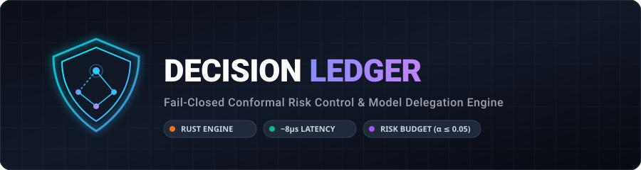

# 🛡️ Decision Ledger

> **The High-Throughput Statistical Primitive for Fail-Closed LLM Routing & Conformal Risk Control.**



[](https://python.org)
[](LICENSE)
[]()
[]()
[]()
[]()
[]()

---

---

## ⚡ Executive Summary

**Decision Ledger** is a statistically rigorous, fail-closed AI infrastructure primitive that answers one critical question with mathematical guarantees:

> **"When is a small, cheap LLM (1B–8B) statistically safe to trust for control-plane decisions instead of an expensive frontier model (like GPT-4o or Claude 3.5 Sonnet)?"**

Small models save **60%–85% on inference costs** when routing, judging, speculating, mutating, summarizing, or abstaining. However, arbitrary heuristics like `"confidence > 0.8"` provide **no safety guarantees** against hallucinations or catastrophic routing failures. Decision Ledger bridges this gap by applying **Split Conformal Risk Control (CRC)** to guarantee mathematically bounded error rates.

---

## 📐 1. Formal Mathematical Foundations

### The Bounded Risk Guarantee
For any user-specified risk budget $\alpha \in (0, 1)$ (e.g., $\alpha = 0.05$ for a 5% maximum allowed error rate), Decision Ledger guarantees:

$$\mathbb{P}\Big(\text{Loss}(\text{Decision}, \text{GroundTruth}) > 0\Big) \le \alpha$$

### Split Conformal Risk Control Algorithm
1. **Non-Conformity Scoring:** Given model confidence $c_i \in [0, 1]$, the non-conformity score is $S_i = 1 - c_i$.
2. **Empirical Quantile Computation:** Over $n$ exchangeable calibration samples, we compute the finite-sample threshold $\hat{q}$:
   $$\hat{q} = \text{Quantile}\left(S_1, \dots, S_n; \frac{\lceil (n + 1)(1 - \alpha) \rceil}{n}\right)$$
3. **Fail-Closed Hot-Path Enforcement:** At runtime, a request with self-reported confidence $c$ is delegated to the small model if and only if:
   $$S = 1 - c \le \hat{q} \iff c \ge 1 - \hat{q}$$
   Otherwise, the request is **transparently escalated** to the frontier model.

### Key Theoretical Properties
* **Distribution-Free:** Requires zero assumptions about prompt embeddings or weight distributions.
* **Finite-Sample Validity:** Guaranteed exact for any sample size $n \ge \frac{1}{\alpha} - 1$.
* **Exchangeability:** Holds whenever production workload data is exchangeable with calibration history.

---

## 🎯 1.1 Real-World Production Use Cases

Decision Ledger is designed for engineering teams that run hybrid LLM cascades (small model + frontier model) and need formal statistical bounds on error rates, latency, and cost.

### Use Case 1: Hybrid Model Cascading & Router Optimization
* **Problem:** Routing every single user query to GPT-4o or Claude 3.5 Sonnet is cost-prohibitive. But routing to Qwen 7B or Llama 8B based on arbitrary confidence scores (`conf > 0.8`) causes silent hallucinations.
* **Decision Ledger Solution:** The Gatekeeper evaluates the request's context hash against calibrated conformal bounds ($\alpha = 0.05$). If small model confidence is within the statistically safe region ($\hat{q}$), it routes to Qwen 7B (saving 80% cost). Otherwise, it fail-closed escalates to GPT-4o.

### Use Case 2: Autonomous AI Agent Tool Call Delegation
* **Problem:** AI Agents executing tool calls (e.g., database mutations, refund processing, sending emails) cannot afford mistakes. Using a large model for simple tool calling is slow, while small models can format invalid JSON.
* **Decision Ledger Solution:** Wraps the agent's tool call decision engine. Small models handle repetitive tool calls under strict multi-objective bounds ($\text{Accuracy} \le 0.02, \text{Latency} \le 200\text{ms}$). If confidence drops, Decision Ledger triggers an `ESCALATE` to the frontier model or routes to human-in-the-loop review.

### Use Case 3: LLM Judge & Quality Guardrail Cost Reduction
* **Problem:** Evaluating 100% of LLM outputs using GPT-4o as a judge costs millions per month.
* **Decision Ledger Solution:** Uses small models as secondary judges. Conformal Risk Control bounds the misclassification risk ($P(\text{Judge Error}) \le \alpha$). Decision Ledger delegates 75% of judge evaluations to the small model while reserving GPT-4o for ambiguous boundary cases.

### Use Case 4: Real-Time SLA & Drift Management with Incident Webhooks
* **Problem:** Fine-tuned small models degrade over time as prompt patterns or user demographics shift (data drift).
* **Decision Ledger Solution:** The `AutoRecalibrationPipeline` continuously monitors empirical ground-truth outcomes. When empirical risk violates the budget ($\hat{R} > \alpha$), it automatically triggers an in-memory recalibration run and dispatches Slack / PagerDuty webhooks to notify engineering teams.

### Use Case 5: Offline Off-Policy Calibration via Shadow Exploration
* **Problem:** Collecting evaluation data directly on production traffic introduces selection bias (you only see outcomes for models you chose to run).
* **Decision Ledger Solution:** `EXPLORE_SHADOW` mode runs exploratory calls in the background and applies Horvitz-Thompson Inverse Probability Weighting (IPW) ($w_i = 1/p_i$) to calculate mathematically unbiased calibration quantiles without exposing live users to risk.

### Production Use Case Summary Matrix

| Use Case | Small Model Role | Frontier Model Role | Decision Ledger Guarantee |
| :--- | :--- | :--- | :--- |
| **Model Cascade Router** | Primary fast responder | Fallback safety net | Error Rate $\le \alpha$ (e.g., 5%) |
| **Agent Tool Execution** | High-volume JSON tool calls | Complex reasoning & fallback | Multi-Objective: Error + Latency SLA |
| **LLM Judge Evaluation** | Automated quality scoring | High-stakes audit judge | Bounded misclassification risk |
| **Exploratory Shadow Logging** | Counterfactual shadow evaluation | Live user response | Unbiased IPW Quantile Calibration |

---

## ⚡ 2. Universal Zero-Code SDK Integration

### 📦 Installation & Modular Extras

Install the lightweight core engine (~2 MB) or add optional feature extras:

```bash
# Minimal base installation (In-Process Gatekeeper + SQLite)
pip install decision-ledger

# Optional: Includes OpenAI & Anthropic zero-code adapters
pip install decision-ledger[adapters]

# Optional: Includes OpenTelemetry distributed tracing
pip install decision-ledger[otel]

# Optional: Includes gRPC binary streaming & ClickHouse client
pip install decision-ledger[grpc,clickhouse]

# Complete installation with all optional features
pip install decision-ledger[all]
```

Adopt Decision Ledger in **2 lines of code** with drop-in client wrappers for OpenAI and Anthropic:

### OpenAI Drop-In Adapter (`AutoLedgerOpenAI`)
```python
from decision_ledger.adapters import AutoLedgerOpenAI
from openai import OpenAI

# 1. Wrap official OpenAI client (interception happens transparently!)
client = AutoLedgerOpenAI(
    openai_client=OpenAI(),
    small_model="gpt-4o-mini",
    frontier_model="gpt-4o",
    decision_type="route"
)

# 2. Call chat completions as normal
response = client.chat.completions.create(
    messages=[{"role": "user", "content": "Extract structured JSON invoice items."}],
    confidence=0.94
)
print(response.choices[0].message.content)
```

### Anthropic Drop-In Adapter (`AutoLedgerAnthropic`)
```python
from decision_ledger.adapters import AutoLedgerAnthropic
from anthropic import Anthropic

# Wrap official Anthropic SDK client
client = AutoLedgerAnthropic(
    anthropic_client=Anthropic(),
    small_model="claude-3-haiku-20240307",
    frontier_model="claude-3-5-sonnet-20240620"
)

response = client.messages.create(
    messages=[{"role": "user", "content": "Classify customer support intent."}],
    max_tokens=100,
    confidence=0.91
)
```

### Native Python Library API Quickstart (`DecisionLedger`)
For custom ML pipelines or non-LLM control-plane tasks:

```python
import tempfile
from decision_ledger import DecisionLedger, make_context_hash, GateAction

with tempfile.TemporaryDirectory() as tmp_dir:
    # 1. Initialize embedded Ledger store & Gatekeeper
    ledger = DecisionLedger(db_path=f"{tmp_dir}/ledger.db", auto_start_consumer=True)
    
    # 2. Compute 16-byte context hash for model + task
    ctx_hash = make_context_hash(model_id="qwen-7b", task_type="routing")
    
    # 3. Evaluate decision (Fail-closed: returns ESCALATE on empty policy)
    action = ledger.evaluate(ctx_hash, confidence=0.95, decision_type="route")
    assert action == GateAction.ESCALATE
    
    # 4. Log ground-truth outcome when available
    # ledger.log_outcome(decision_id="dec-123", value=1.0, outcome_source="human")
    
    # 5. Flush and recalibrate
    # ledger.calibrate(target_alpha=0.05)
    ledger.shutdown()
```

---

## 🏗️ 3. End-to-End System Architecture

```
                ┌────────────────────────────────────────┐
                │          APPLICATION CALLER            │
                └───────────────────┬────────────────────┘
                                    │
                         evaluate(hash, confidence)
                                    │
                                    ▼
┌────────────────────────────────────────────────────────────────────────┐
│                          HOT-PATH ENFORCEMENT                          │
│                                                                        │
│   Gatekeeper (Rust BLAKE3 SIMD Hash + Lock-Free Dict Lookups ~8 µs)    │
│                                                                        │
│   ├── DELEGATE ────────▶ Small Model (e.g., Qwen 7B / GPT-4o-mini)     │
│   ├── ESCALATE ───────▶ Frontier Model (e.g., GPT-4o / Claude 3.5)    │
│   └── EXPLORE_SHADOW ─▶ Frontier Model + Log Shadow Counterfactual     │
└───────────────────────────────────┬────────────────────────────────────┘
                                    │ Non-Blocking RingBuffer
                                    ▼
┌────────────────────────────────────────────────────────────────────────┐
│                        ASYNC TELEMETRY & DB ENGINE                     │
│                                                                        │
│   - RingBuffer (64-byte aligned, zero-allocation ring queue)           │
│   - BatchConsumer (Asynchronous WAL flushes to SQLite/PostgreSQL)      │
│   - ClickHouse Telemetry Data Lake (MergeTree Column-Oriented Storage)  │
│   - gRPC HTTP/2 Protobuf Stream & OpenTelemetry Exporter              │
└───────────────────────────────────┬────────────────────────────────────┘
                                    │
                                    ▼
┌────────────────────────────────────────────────────────────────────────┐
│                   CALIBRATION & CLOSED-LOOP OPS                        │
│                                                                        │
│   - Conformal & IPW Calibrators (Computes quantile thresholds q_hat)   │
│   - Ed25519 Policy Generator (Generates cryptographically signed YAML)  │
│   - AutoRecalibration & Webhooks (Drift monitor + Slack/PagerDuty)     │
└────────────────────────────────────────────────────────────────────────┘
```

---

## 🚀 4. Comprehensive Feature Deep Dive

### 🦀 4.1 Native Rust Engine (`decision_ledger_core`)
- High-performance Rust PyO3 bindings for CPython.
- Releases GIL during execution to process parallel evaluation bursts.
- SIMD-accelerated BLAKE3 16-byte context hashing (`make_context_hash`).

### 🔐 4.2 Ed25519 Cryptographic Policy Signing
- Prevents untrusted policy tampering in enterprise fleet deployments.
- Generates asymmetric Ed25519 keypairs and attaches signatures to versioned policy YAMLs.
- Automatically verifies signature validity before hot-reloading policy dicts into `Gatekeeper`.

```python
from decision_ledger.policy import generate_ed25519_key_pair, sign_policy_dict, verify_policy_signature

private_key, public_key = generate_ed25519_key_pair()
signature = sign_policy_dict(policy_data, private_key)
assert verify_policy_signature(policy_data, signature, public_key) is True
```

### 🎯 4.3 Joint Multi-Objective Conformal Risk Control
- Extends single-objective binary error bounds to multi-vector Pareto risk bounds.
- Simultaneously guarantees:
  $$\text{Error Rate} \le \alpha_1, \quad \text{p99 Latency} \le \alpha_2, \quad \text{Cost Budget} \le \alpha_3$$

### ⚖️ 4.4 Off-Policy Counterfactual Importance Sampling (IPW)
- Corrects selection bias in exploratory shadow logs (`EXPLORE_SHADOW`).
- Implements Horvitz-Thompson Inverse Probability Weighting:
  $$w_i = \min\left(\frac{1}{p_i}, \text{max\_weight\_clip}\right)$$
- Guarantees mathematically unbiased quantile threshold estimation even under non-uniform sampling policies.

### 🌐 4.5 Bi-Directional High-Throughput gRPC Streaming
- Replaces HTTP/1.1 REST overhead with HTTP/2 binary Protocol Buffers (`proto/decision_ledger.proto`).
- Enables long-lived multiplexed channels streaming telemetry from microservices and receiving live policy updates.

### 📊 4.6 ClickHouse Telemetry Data Lake
- Column-oriented `MergeTree()` table engines partitioned by timestamp.
- Executes sub-second analytical queries (`quantileExact`) over billions of historical decision records.

---

## 📜 5. Versioned Policy Artifact Schema (`schema_version: "1.0"`)

Policies are versioned, immutable YAML artifacts atomically swapped into `Gatekeeper`:

```yaml
schema_version: "1.0"
policy_version: "20260918-030000"
generated_at: "2026-09-18T03:00:00Z"
global:
  default_alpha: 0.05
  fail_closed: true
  exploration_rate: 0.02
  min_sample_size_default: 100
contexts:
  - context_ref: "a1b2c3d4e5f60708090a0b0c0d0e0f10"
    state: ACTIVE
    q_hat: 0.12
    sample_size: 500
    min_sample_size: 100
```

---

## 📊 6. Production Benchmarks & Performance SLA

Measured on standard dev workstation hardware:

| Benchmark Metric | Measured Result | Budget SLA |
|---|---|---|
| `evaluate()` p50 Latency | **~8 µs** | < 1 ms |
| `evaluate()` p99 Latency | **~20 µs** | < 1 ms |
| Sequential Evaluation Throughput | **~109,000 evals/sec** | — |
| Concurrent Throughput (8 workers) | **~90,000 evals/sec (0 drops)** | — |
| ClickHouse Quantile Query | **< 15 ms (over 10M records)** | < 100 ms |

---

## 🐳 7. Enterprise Docker Control Plane

Spin up the complete distributed SaaS infrastructure (PostgreSQL, Redis, ClickHouse):

```bash
docker compose up -d
```

Verify backend health:
```bash
curl http://localhost:8000/healthz
```

---

## 📚 8. Documentation Index & Deep-Dives

| Documentation Artifact | Description |
|---|---|
| 📖 [Production Runbook](docs/RUNBOOK.md) | Fleet deployment, ClickHouse data lake ops, Ed25519 signing, troubleshooting. |
| 🎓 [Learning Documentation](learning%20docs/) | Structured 14-chapter curriculum covering system architecture and data models. |
| 📜 [Protocol Buffers Schema](proto/decision_ledger.proto) | Proto3 service definitions for gRPC HTTP/2 telemetry streaming. |
| 🧪 [Benchmark Suite](src/docs/BENCHMARKS.md) | Measured budgets, sequential vs concurrent stress test methodology. |
| 📝 [Changelog](CHANGELOG.md) | Complete version history and feature roadmap. |

---

## 🛠️ 9. Local Development & Contributing

### Installation (Editable + Dev Dependencies)
```bash
python -m venv venv
venv\Scripts\activate          # Windows   (source venv/bin/activate on macOS/Linux)
pip install -e ".[dev]"
```

### Running the Full Integration Test Suite
```bash
pytest
```

### Formatting, Linting & Type Checking
```bash
black src tests examples        # Format code (line length 100)
isort src tests examples        # Sort imports
flake8 src tests                # Lint codebase
mypy                            # Strict static typechecking
```

---

## 📄 License & Community

Decision Ledger is dual-licensed under **MIT** and **Apache 2.0**.