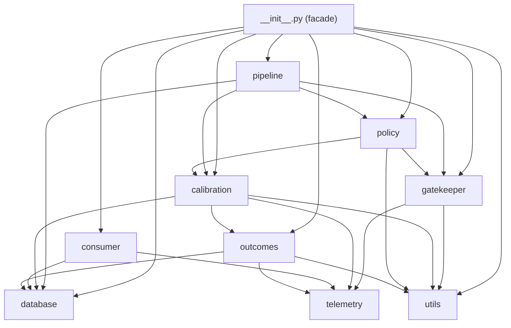

# 01 — Executive Summary & Repository Map

## 1. Executive summary

**What the system is.** Decision Ledger is a Python library (plus a CLI) that
answers a single question with statistical machinery: *when is a small model
safe to trust for control-plane decisions?* It records every model decision,
links each one to an independent outcome, computes a delegation threshold with
conformal risk control, and enforces that threshold through a fail-closed
gatekeeper on the serving path.

**What the system is not.** It does not host models, run an HTTP API, or
provide a frontend. It is an embeddable library: an application imports
`DecisionLedger`, calls `evaluate()` on the hot path, and calls `log_outcome()`
later when ground truth arrives.

**Core loop.**

```mermaid
flowchart LR
    App[Application] -->|evaluate(ctx, conf)| GK[Gatekeeper]
    GK -->|DELEGATE / ESCALATE / EXPLORE_SHADOW| App
    GK -.telemetry.-> RB[(RingBuffer)]
    RB -.poll 100ms.-> C[BatchConsumer]
    C -->|batch_insert| SQL[(SQLite)]
    App -->|log_outcome| OC[OutcomeCollector]
    SQL -->|join| J[Joiner]
    J --> CAL[Calibrator]
    CAL --> P[PolicyGenerator]
    P -->|artifact YAML| GK2[Gatekeeper reload]
```

**Key numbers** (measured on the dev box, `src/docs/BENCHMARKS.md`, and
re-verified during review on Python 3.14):

| Metric | Value | Budget |
| --- | --- | --- |
| `evaluate()` hot path (no telemetry) | ~1.0–1.1 µs mean | < 1 ms |
| `evaluate()` incl. telemetry, end-to-end | p50 7.7 µs, p99 26.6 µs | < 1 ms |
| Ring buffer drain `pop_batch(1000)` | ~53–72 µs | < 100 µs |
| SQLite batch insert | ~118k rows/s single tx | — |
| Consumer durable flush | ~60–62k records/s | aspirational 1M/s (documented gap) |
| Calibration of 100k records / 100 contexts | < 120 s | — |
| Test suite | 308 tests pass, 97% coverage | — |

## 2. Repository map

### Top-level inventory

| Path | Kind | Responsibility |
| --- | --- | --- |
| `pyproject.toml` | Config | PEP 621 metadata, dynamic version, tool config (black/isort/flake8/mypy/pytest/build) |
| `src/setup.py` | Config | Legacy build entrypoint mirroring `pyproject.toml` metadata |
| `src/decision_ledger/` | Package | The library (11 modules) |
| `src/examples/` | Examples | 4 runnable demonstration programs |
| `src/tests/` | Tests | Unit + integration suite for the package (308 total w/ `tests/`) |
| `tests/` | Tests | End-to-end system tests |
| `src/docs/` | Docs | Architecture, API, benchmarks, style, quickstart, runbook |
| `docs/` | Docs | Top-level runbook |
| `dist/` | Build output | Built sdist + wheel (`decision_ledger-1.0.0rc1`) |
| `venv/` | Env | Local virtual environment (gitignored) |
| `data/policies/`, `policies/` | Runtime data | Generated policy artifacts (gitignored) |
| `benchmarks/`/`.benchmarks/` | Runtime data | pytest-benchmark cache, coverage data |
| `README.md` | Doc | Project overview + claims |
| `CHANGELOG.md` | Doc | Release history incl. packaging rationale |
| `LICENSE` | Meta | MIT license |
| `MANIFEST.in` | Config | sdist contents |
| `Makefile` | Tooling | install/test/cov/format/lint/typecheck/check/sdist/clean |
| `requirements.txt` | Env | Runtime deps (numpy, PyYAML, blake3, uuid6, build) |
| `.flake8` | Config | flake8 overrides |
| `.gitignore` | Config | Git ignores |
| `.coverage`, `.pytest_cache`, `.mypy_cache`, `.benchmarks` | Runtime | Tool artifacts (gitignored) |
| `decision ledger iv.pdf` | Doc | External spec document (not part of the source tree per se) |

### The `src/decision_ledger` package — module inventory

| Module | Lines | Responsibility | Key public surface |
| --- | --- | --- | --- |
| `__init__.py` | 429 | Orchestrator facade + re-exports | `DecisionLedger` |
| `gatekeeper.py` | 374 | Hot-path decision enforcement | `Gatekeeper`, `CalibrationContext`, `DecisionType`, `GateAction` |
| `calibration.py` | 379 | Conformal risk-control math | `ConformalCalibrator`, `CalibrationRecord`, `CalibrationResult` |
| `database.py` | 718 | SQLite persistence layer | `Database`, `Joiner`, `DatabaseError`, `init_database` |
| `consumer.py` | 462 | Background drains to SQLite / JSONL | `BatchConsumer`, `JsonlExport` |
| `policy.py` | 539 | Versioned policy artifacts | `PolicyGenerator`, `ServingPolicy`, `validate_policy`, `load/save_policy` |
| `outcomes.py` | 607 | Outcome logging + join records + CLI | `OutcomeCollector`, `OutcomeSource`, CLI `main` |
| `pipeline.py` | 148 | Calibration orchestration | `CalibrationPipeline` |
| `telemetry.py` | 226 | Decision record + ring buffer | `DecisionRecord`, `RingBuffer` |
| `utils.py` | 318 | Hashing, ids, time, logging, validation | `make_context_hash`, `generate_uuidv7`, `now_ns`, `setup_logging` |
| `__version__.py` | 7 | Version single source of truth | `__version__` (`"1.0.0rc1"`) |
| `py.typed` | 1 | PEP 561 marker (typed package) | — |

**Dependency graph (imports inside the package):**



Note the controlled cycle: `gatekeeper` imports `policy` *lazily inside a
method* (`gatekeeper.py:323`) to avoid an import-time cycle, because `policy`
imports `gatekeeper` (`policy.py:53`). This is visible evidence of the module
boundary being intentionally managed `[E]`.

### External dependencies (runtime)

| Dependency | Used by | Notes |
| --- | --- | --- |
| `numpy` | `calibration.py` | vectorized argsort/cumsum for q_hat |
| `PyYAML` | `policy.py` | policy artifact serialization |
| `blake3` (or `hashlib.blake3`) | `utils.py` | context hashing |
| `uuid6` (or stdlib `uuid.uuid7`) | `utils.py` | UUIDv7 identifiers on <3.14 |

### Tests inventory (`src/tests/` + `tests/`)

| File | Covers |
| --- | --- |
| `test_calibration.py` | q_hat math, Wilson bound, context calibration, drift, edge cases |
| `test_consumer.py` | consumer batch mechanics |
| `test_database.py` | schema, locking, thread-local connections |
| `test_gatekeeper.py` | hot-path logic, exploration, reload, thread-safety (incl. latency benchmark) |
| `test_gatekeeper_policy_file.py` | load/reload/convert from artifacts |
| `test_integration.py`, `test_integration_week1.py` | pipeline + concurrency + benchmark suites |
| `test_joiner.py` | join semantics, idempotency |
| `test_ledger.py` | orchestrator facade |
| `test_outcomes.py` | outcome validation, CLI, join records |
| `test_pipeline.py` | calibration pipeline |
| `test_policy.py` | policy artifact validation |
| `test_storage_pipeline.py` | consumer+producer concurrency, shutdown |
| `test_telemetry.py` | ring buffer tiers/drops |
| `test_utils.py` | hashing, ids, validation |
| `test_end_to_end.py` (`tests/`) | full-system workflows, latency, lock degradation |

### Configuration & environment

* **Python**: `requires-python = ">=3.8"`; developed/verified on 3.14
  (`pyproject.toml:16`). All modules use `from __future__ import annotations`
  so PEP-604 unions (`str | Path`) in signatures are safe on 3.8 `[E]`.
* **Formatter/linter**: black (line-length 100), isort, flake8 (E203/W503
  ignored), mypy `--strict` (`pyproject.toml:85-105`).
* **Version**: dynamic, read from `src/decision_ledger/__version__.py` via
  `[tool.setuptools.dynamic]` (`pyproject.toml:69-70`).
* **CI/CD**: no hosted CI config is present in the repo; the Makefile encodes
  the same gate (check-format → lint → typecheck → test) and the checklist doc
  (`git log` shows a "Verification Checklist" commit) serves the gate `[E]`.

### Generated code / artifacts

* `src/decision_ledger.egg-info/`, `build/`, `dist/` — packaging artifacts (gitignored).
* `.mypy_cache/`, `.pytest_cache/`, `.benchmarks/`, `.coverage` — tool caches.
* `data/policies/*.yaml` — policy artifacts generated at runtime by the
  examples/tests (gitignored).

### Architectural significance of the layout

The package uses a **src-layout** (`src/decision_ledger`), which forces the
test suite to import the *installed* distribution rather than a stray
`decision_ledger` directory in the repo root — a small but meaningful packaging
hygiene choice `[E]` (see `pyproject.toml:72-78`). The separation of `src/tests`
(unit/integration) from `tests/` (end-to-end) reflects two test layers, and the
docs are co-located in `src/docs` so they ship inside the sdist/wheel `[E]`.