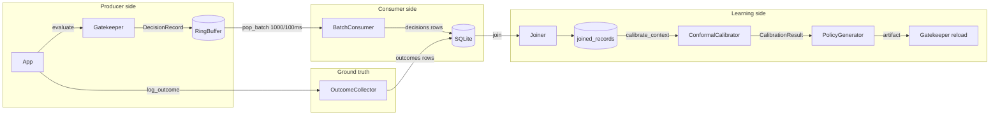

# 02 — System Mental Model

## The problem

Small models (1–7B params) are cheap and fast enough to run control-plane
decisions — *routing, judging, speculating, mutating, summarizing, abstaining*.
The danger: "confidence > 0.7" is not a safety argument. A model can be
confident and wrong, and an over-confident small model making control-plane
decisions can cause real damage.

Decision Ledger's thesis (stated in `README.md` and `src/docs/DESIGN.md`):
instead of trusting raw confidence, **measure empirically** — record every
decision, observe its outcome, compute a *delegation threshold* such that the
empirical risk of a delegated decision stays within a user-chosen budget
`alpha`, and enforce that threshold every time.

## The guarantee the system promises

For a risk budget `alpha` (default 0.05) the design documents claim:

```
P(Loss(Decision, GroundTruth) > 0) <= alpha
```

computed from exchangeable calibration data, where `Loss` is binary
(`0.0` = correct, `1.0` = incorrect after an outcome is observed).

> ⚠️ **Read this with care.** The *implemented* threshold is computed as the
> largest non-conformity score whose cumulative *empirical* risk on the
> calibration set is ≤ `alpha` (`calibration.py:143-204`). That is an
> empirical-risk guarantee with a Wilson confidence bound reported alongside.
> The strongest "finite-sample, distribution-free" claim in the docs is
> stronger than what the estimator mechanically provides. This is analyzed in
> `09-weaknesses-and-technical-debt.md` and `07-architecture-decisions-and-tradeoffs.md`.

## Major actors

* **Model application (producer)** — calls `evaluate()` for every decision,
  then later calls `log_outcome()` with ground truth.
* **Gatekeeper** — the only hot-path component. Decides `DELEGATE` /
  `ESCALATE` / `EXPLORE_SHADOW`.
* **Ring buffer** — bounded in-memory telemetry capture; the producer never
  blocks on disk.
* **BatchConsumer** — background thread draining the buffer to SQLite.
* **SQLite database** — durable store: decisions, outcomes, joined records,
  policy history.
* **OutcomeCollector** — validates and persists outcomes, keyed by
  `decision_id`.
* **Joiner** — materializes decision↔outcome pairs into `joined_records`.
* **ConformalCalibrator** — computes per-context `q_hat` + drift signal.
* **PolicyGenerator** — publishes versioned, validated YAML policy artifacts.
* **DecisionLedger** — the facade that wires everything together.

## Major boundaries

| Boundary | Who is on each side | Why it matters |
| --- | --- | --- |
| Hot path vs. everything else | `Gatekeeper.evaluate()` ← producer threads | The hot path must be microseconds and allocation-light; everything else is off-path. |
| Producer vs. consumer | `RingBuffer.push` (sync) vs. `BatchConsumer` poll (async) | Absorbs disk jitter; producer never waits on SQLite. |
| Durable vs. derived | `decisions`/`outcomes` (source of truth) vs. `joined_records`/`policies` (derived views) | Derived data can be rebuilt; source tables cannot. |
| Policy authoring vs. serving | `PolicyGenerator` (write artifacts) vs. `Gatekeeper` (read + hot reload) | Validated, immutable artifacts; atomic swap at serving. |

## Major data stores

| Store | Kind | Contents |
| --- | --- | --- |
| `decisions` | SQLite table | Every gatekeeper evaluation: id, timestamp, context, confidence, non-conformity, action, latency |
| `outcomes` | SQLite table | Ground-truth labels: outcome_id, decision_id (FK), value, source, metadata |
| `joined_records` | SQLite table | Materialized decision+outcome rows for calibration |
| `policies` | SQLite table | Policy history (rarely used; the primary authoring path is YAML files) |
| YAML policy artifacts | Filesystem | `policy_<YYYYMMDD-HHMMSS>.yaml` + `policy_latest.yaml` pointer |
| Ring buffer | In-memory deque | Latest decisions awaiting drain |

## Major data flows



## Major control flows

1. **Steady-state serving.** Producer → `evaluate()` → gatekeeper → ring
   buffer → consumer → SQLite → (independent) outcome logger.
2. **Calibration cycle.** `calibrate()` drains buffered decisions, runs the
   joiner, calibrates every context that has outcomes, detects drift, generates
   a policy artifact, and hot-reloads it into the gatekeeper.
3. **Shutdown.** Stop consumer → final drain → final stats snapshot → close DB.

## Reading the system as a newcomer

1. Start at `src/decision_ledger/__init__.py` and read the `DecisionLedger`
   class docstring. It is a numbered checklist of the whole system.
2. Read `gatekeeper.py` next — it is the piece with the strictest performance
   contract and the cleanest design notes.
3. Read `telemetry.py` and `consumer.py` together; they form one pipeline
   (buffer → drain → persist) and the docs explain *why* they are split.
4. Read `database.py` — largest module, but the section headers make it
   skippable in order: lifecycle → schema → lock/retry → queries → domain
   queries → Joiner.
5. Then `outcomes.py`, `calibration.py`, `policy.py`, `pipeline.py` in that
   order, because each builds on the previous.
6. Finally run the examples and read the docs that mirror your use case.

The single most important mental shortcut: **the ledger separates the action
(the offer) from the verdict (the outcome).** Nearly every design decision in
this repo follows from keeping that separation fast (`RingBuffer`), durable
(`batch_insert`), joinable (`joined_records`), and actionable (`policy` +
reload).