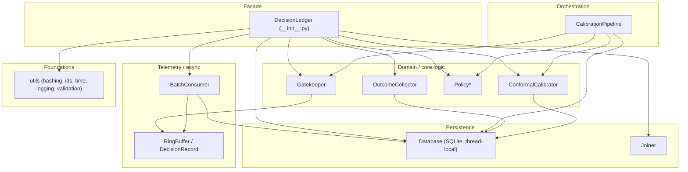

# 03 — Architecture Overview & Component Architecture

## 3.1 Architectural style

The system is a **layered, embedded library** in an *event-sourced-ish* shape:

* **Style:** a small dependency-injected facade (`DecisionLedger`) wiring
  distinct single-responsibility modules. Not a framework, not a service —
  the application embeds it.
* **Layer order (top → bottom):**

* **Dependency rule:** higher layers depend on lower layers; lower layers never
  import the facade. The only cycle (`gatekeeper` ⇄ `policy`) is broken by a
  lazy import inside a method (`gatekeeper.py:323`) `[E]`.

## 3.2 Component architecture

### 3.2.1 `DecisionLedger` (facade) — `__init__.py:79-435`

**Responsibility:** construct and wire everything; expose a small API
(`evaluate`, `log_outcome`, `calibrate`, `stats`, `shutdown`).

**What it does:**
* Creates `Database`, `RingBuffer`, `Gatekeeper`, `OutcomeCollector`,
  `ConformalCalibrator`, `PolicyGenerator`, `BatchConsumer`
  (`__init__.py:132-157`).
* `evaluate()` enforces the closed state (raises after shutdown), normalizes the
  `confidence`/`model_confidence` alias pair, calls the gatekeeper, and returns
  a string action — with a **fail-closed catch-all**: any unexpected gatekeeper
  exception returns `ESCALATE` (`__init__.py:225-233`).
* `calibrate()` orchestrates drain → join → pipeline → reload
  (`__init__.py:293-330`).
* `shutdown()` is idempotent-guarded, stops the consumer, final drains, writes
  a final stats JSON, and closes the DB (`__init__.py:377-412`).

**Dependencies:** all modules. **Dependents:** applications and examples.

**Significance:** this is the "composition root" — the only place where object
graphs are built. Everything else is testable in isolation. `[E]`

### 3.2.2 `Gatekeeper` — `gatekeeper.py:103-374` (hot path)

**Response:** decide `DELEGATE` / `ESCALATE` / `EXPLORE_SHADOW` in
microseconds.

* Holds a `Dict[bytes, CalibrationContext]` policy snapshot guarded by one
  `RLock` (`gatekeeper.py:124`, `188`).
* Fail-closed branches: unknown context, inactive context, sample below
  minimum, no `q_hat` → escalate (`gatekeeper.py:193-214`).
* Deterministic exploration by call number: call `n` explores when
  `n % int(1/rate) == 0` (`gatekeeper.py:231-245`). No PRNG on purpose
  (reproducibility + exact measured rate).
* Non-conformity score `s = 1 - confidence`; delegate when `s <= q_hat`
  (`gatekeeper.py:222-225`).
* `_record()` optionally pushes a `DecisionRecord` to the ring buffer
  (`gatekeeper.py:354-373`).
* Metrics (`get_metrics`) with per-decision-type escalation rates.

### 3.2.3 `ConformalCalibrator` — `calibration.py:102-373`

**Response:** compute `q_hat` per context and detect drift. Two modes:
* Pure statistics on `CalibrationRecord` iterables (`compute_threshold`,
  `calibrate_by_context`) — used offline/in tests.
* Database-backed (`calibrate_context`, `detect_drift`) — used by the pipeline.

Key algorithm (`compute_threshold`): filter to independent non-exploratory
records → enforce `min_sample_size` → sort by score → cumsum losses → prefix
empirical risk → largest prefix with risk ≤ `alpha` → `q_hat` = that prefix's
score → Wilson coverage lower bound (`calibration.py:143-204`).

### 3.2.4 `Database` + `Joiner` — `database.py:209-718` (persistence)

**Response:** durable store, one connection per thread, autocommit, retries.

* `threading.local` connection per thread; each new connection re-applies the
  idempotent schema (`database.py:252-281`).
* Writes autocommit; `batch_insert` wraps one explicit `BEGIN/COMMIT`
  transaction with rollback-on-error (`database.py:493-502`).
* `_run_with_lock_retry`: 3 attempts on `database is locked` (`database.py:358-377`).
* `Joiner` materializes LEFT JOIN decision↔outcome rows once per decision,
  idempotent via `ON CONFLICT(joined_id) DO NOTHING` (`database.py:687-701`).

### 3.2.5 `BatchConsumer` — `consumer.py:50-380` (async persistence)

**Response:** background thread; poll the buffer, batch, flush; never crash;
never silently lose what it holds (with the caveat documented in `09`).

* Loop: `pop_batch(1000)` → append to in-memory batch → flush when ≥
  `batch_size` or `flush_interval` elapses (`consumer.py:201-234`).
* Flush retries (3 attempts) then holds records in memory with a 100k backlog
  cap + critical alerts (`consumer.py:273-337`).
* `drain_now()` synchronous drain (used by `calibrate`) — capped at 10k per call.

### 3.2.6 `OutcomeCollector` / `InMemoryOutcomeCollector` — `outcomes.py`

**Response:** accept ground truth, validate, persist. The durable collector
enforces: decision exists, value ∈ [0,1], known source, valid JSON metadata.

### 3.2.7 `PolicyGenerator` + artifact pipeline — `policy.py`

**Response:** turn calibration results into validated, versioned YAML, and
publish a `policy_latest.yaml` pointer. States: `ACTIVE` / `DRAINING` /
`REVOKED`. Gates unknown contexts to fail-closed by leaving them out.

### 3.2.8 `CalibrationPipeline` — `pipeline.py`

**Response:** for each context with outcomes → calibrate + drift → generate
policy → reload gatekeeper → return artifact path.

### 3.2.9 `RingBuffer` / `DecisionRecord` — `telemetry.py`

**Response:** zero-lock, bounded capture with tiered backpressure warnings and
drop policy (exploratory records sacrificed first at overload).

### 3.2.10 `utils` — `utils.py`

**Response:** hashing (context identity), UUIDv7 ids, ns/us time, logging setup,
validation helpers.

## 3.3 Design patterns in use

| Pattern | Where | Why |
| --- | --- | --- |
| Facade | `DecisionLedger` | One composition root; hide wiring from callers |
| Dependency injection (constructor) | All components receive their collaborators (`Gatekeeper(telemetry=...)`, `ConformalCalibrator(database)`) | Testability; swaps for tests |
| Strategy | `compute_threshold` vs `calibrate_context`; `BatchConsumer` vs `JsonlExport` | Different persistence strategies over the same buffer abstraction |
| Immutable snapshot / copy-on-write | `reload_policy` swaps the whole dict; `DecisionRecord` is frozen+slots | Concurrent readers never see partial state |
| Repository (light) | `Database` exposes domain queries (`get_decisions`, `get_join_statistics`) | Opaque SQL behind a typed surface |
| Observer/publish-subscribe (light) | Ring buffer + consumer polling | Producer decoupled from sink |
| Marker/hub config | `pyproject.toml` is authoritative; `setup.py` mirrors | One source of truth for packaging |

## 3.4 Major architectural decisions (short list; full ADRs in `07`)

1. **Embedded library, not a service** — no HTTP layer. `[E]`
2. **SQLite with autocommit + thread-local connections** — durability without a
   server (`database.py:7-23`).
3. **Ring buffer decouples producer from disk** — never-blocking hot path
   (`telemetry.py:1-14`).
4. **Deterministic exploration instead of PRNG** — reproducibility
   (`gatekeeper.py:18-21`).
5. **Policy as immutable, versioned artifacts + atomic reload** — auditable,
   rollback-able (log shows a `rollback_policy` surface in `policy.py:382-399`).
6. **Joined records materialized in SQL** — calibration reads a flat table.
7. **WAL-less SQLite** — single file for OneDrive sync compatibility
   (`database.py:20-22`).
8. **Numpy for the quantile computation** — clarity + vectorization.

## 3.5 When this architecture stops being appropriate

* **Scale:** single-process, single-file SQLite. If multiple processes/writers
  or >~10⁶ decisions/hour are required, the DB layer (or the whole storage)
  must change. `[I]`
* **Multi-tenant isolation:** no notion of tenancy; policy is global per process.
* **Distributed serving:** the gatekeeper's in-process policy snapshot must be
  reloaded in every replica; the load/reload file path implies an external
  process (e.g., cron/ops) to trigger it. `[I]`
* **Non-degradable telmetry:** the ring buffer is lossy-by-design under
  overload; if every record must be kept, Kafka-style durable queues or WAL
  first is required.