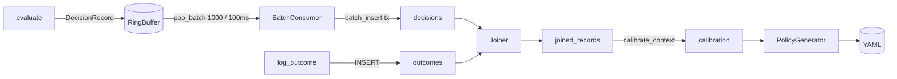

# 04 — Data Architecture

## 4.1 Store inventory

| Store | Technology | Durability | Canonical? |
| --- | --- | --- | --- |
| `decisions` table | SQLite, autocommit, WAL-less | Yes (flushed batches) | **Yes — source of truth for decisions** |
| `outcomes` table | SQLite | Yes | **Yes — source of truth for outcomes** |
| `joined_records` table | SQLite | Yes (derived) | No — rebuildable by `Joiner` |
| `policies` table | SQLite | Yes | No — authoring path is YAML files |
| Ring buffer | in-memory `deque` | No (volatile by design) | No — capture only; sources are rebuilt from SQLite |
| YAML policy files | Filesystem | Yes | Yes for the serving policy |
| `*_stats.json` | Filesystem | Yes | No — observability |

## 4.2 Entity-relationship (logical)

```mermaid
erDiagram
    DECISIONS ||--o{ OUTCOMES : "has at most one"
    DECISIONS ||--o{ JOINED_RECORDS : "produces"
    OUTCOMES ||--o{ JOINED_RECORDS : "feeds"
    JOINED_RECORDS ||--o{ POLICIES : "calibrates into"

    DECISIONS {
        TEXT decision_id PK
        INTEGER timestamp_ns
        TEXT context
        REAL confidence
        REAL non_conformity
        TEXT action
        INTEGER latency_us
    }
    OUTCOMES {
        TEXT outcome_id PK
        TEXT decision_id UNIQUE FK
        REAL value
        TEXT source
        TEXT metadata
        INTEGER timestamp_ns
    }
    JOINED_RECORDS {
        TEXT joined_id PK
        INTEGER decision_timestamp_ns
        TEXT context
        REAL confidence
        REAL non_conformity
        TEXT action
        REAL outcome_value
        TEXT outcome_metadata
        INTEGER created_at_ns
    }
    POLICIES {
        INTEGER id PK
        TEXT policy_id
        TEXT context
        TEXT state
        REAL q_hat
        TEXT created_at
        TEXT artifact_path
    }
```

**Cardinality note.** One decision has **at most one** outcome because the
`outcomes.decision_id` column is `UNIQUE` (`outcomes.py` enforces
"already has an outcome" before insert). The join is therefore `LEFT OUTER`
and each `joined_id` is unique — the calibration table is already
deduplicated. `[E]`

## 4.3 Schema details (from `database.py` DDL)

* `decisions` — write path: one row per `evaluate()`. `latency_us` is nullable
  (telemetry can be disabled). `non_conformity = 1 - confidence` computed at
  insert time for query-time convenience (denormalized-but-immutable).
* `outcomes` — `decision_id UNIQUE` + `FOREIGN KEY`; `value REAL` constrained
  to `[0,1]` in the collector; `metadata TEXT` holds validated JSON.
* `joined_records` — a **denormalized join of decisions+outcomes**; one row per
  decision, `outcome_value` NULL until an outcome exists. Calibration queries
  never join two tables; they read this one.
* Indexes mirror the hot queries: context+timestamp for calibration windows,
  decision_id for join lookups.

## 4.4 The join semantics (critical detail)

`Joiner.materialize_join()` (`database.py:687-701`) does:

```
INSERT INTO joined_records (...) 
SELECT d.*, o.value, o.metadata FROM decisions d
LEFT OUTER JOIN outcomes o ON o.decision_id = d.decision_id
WHERE d.decision_id > :last_joined
ON CONFLICT(joined_id) DO NOTHING
```

* **Idempotency** — `ON CONFLICT DO NOTHING` + `last_joined` watermark makes
  re-runs safe; a crash mid-join re-runs harmlessly.
* **Late outcomes.** If an outcome arrives *after* a decision was already
  joined (with `outcome_value = NULL`), the null stays forever: `DO NOTHING`
  never overwrites. This is a **known limitation** — late outcomes never feed
  calibration (see `09-weaknesses-and-technical-debt.md`, MED-1; anchored code
  `database.py:687-701`, `pipeline.py:145-148`).
* **Balance/parity.** The pipeline balances groups by outcome value count, so
  calibration sees matched records (see `calibration.py` group-balancing logic).

## 4.5 Write durability

* Every SQLite connection is **autocommit**: each `execute` is its own commit
  (`database.py:252-281`).
* `batch_insert` groups N decisions into **one explicit transaction**
  (`BEGIN` → inserts → `COMMIT`, rollback on error) — the atomic unit is the
  batch, not the record (`database.py:493-502`).
* **WAL is deliberately off** (`database.py:20-22`): the database file must stay
  a single portable file for sync-based replication/backups. Tradeoff: readers
  and the single writer contend; mitigated by the single-writer design + retry.
* Consumer flush: retry up to 3 attempts, then holds records in memory with a
  100k backlog cap that triggers critical logging rather than dropping
  (`consumer.py:273-337`). The window between poll and commit is the crash-loss
  window (see LOW notes in `09`).

## 4.6 Data lifecycle



## 4.7 Calibration record semantics

`CalibrationRecord` (used by `calibrate_by_context`) is the bridge between SQL
rows and the conformal math. It carries: `decision_id`, `context`,
`non_conformity`, `action`, `explored` flag, `outcome_value`. The
`explored` flag matters — exploratory records **are excluded** from the
threshold computation (they exercised the context without a decision).
`[E]` (`calibration.py` record/dataclass).

## 4.8 Data volumes & retention

* Recommended retention: decisions volume grows ~1 row/evaluate; benchmark
  budgets assume ~10⁶/hour is fine for SQLite single-file on this design, but
  no retention pruner exists in code. Retention/archival is an operational
  concern left to the caller. `[E]` (no TTL/deletion code present).

## 4.9 Consistency guarantees

| Concern | Guarantee |
| --- | --- |
| Schema upgrades | None visible (no migration framework; pro‑schema version constant 1) — a breaking change needs a DB recreate or manual migration. |
| Cross-thread visibility | `threading.local` connections => each thread sees only its own committed state; producers/consumers agree on committed batches. |
| Idempotent calibration | Watermark + `DO NOTHING` => re-running `calibrate()` is safe. |
| Policy rollout | Immutable artifact per timestamp + `policy_latest` pointer => atomic switch. |
| Backpressure | Ring buffer drops *exploratory-first* at overload (no deadlock, lossy-only-for-non-critical rows). |

## 4.10 The `policies` table vs YAML files

There are **two** policy stores: the `policies` SQLite table (history; used by
`load_policy_history`) and the **YAML filesystem artifacts**. The *active
serving* path is YAML → `validate_policy` → `reload_policy`. The SQLite table is
a journal of generated artifacts (each artifact records its own path). The
filesystem is the interchange format — which is why `policy_latest.yaml` exists
and why the runbook tells operators where files live. `[E]`