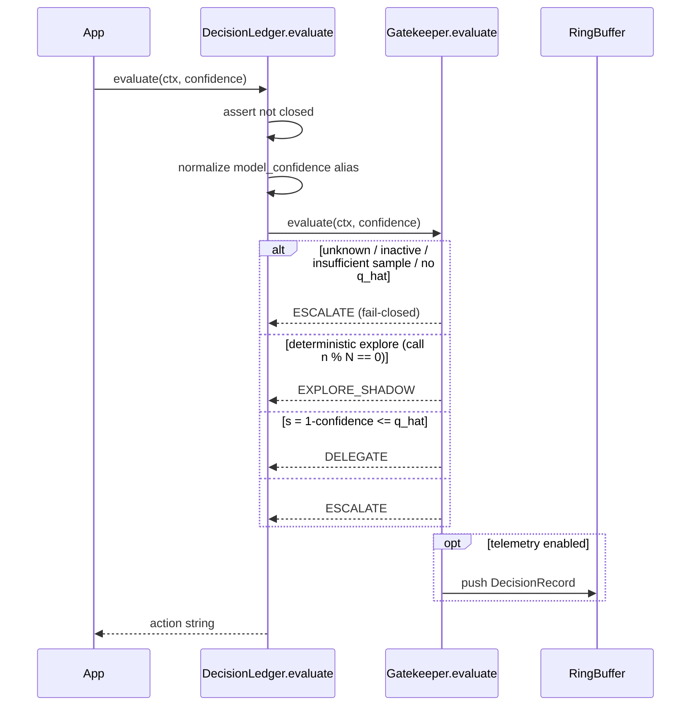
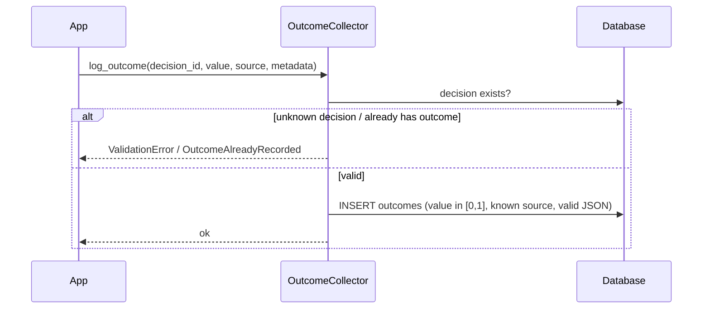
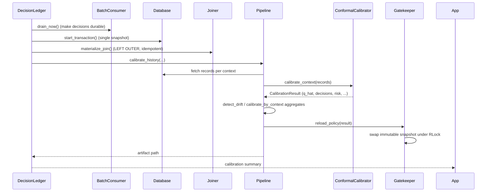
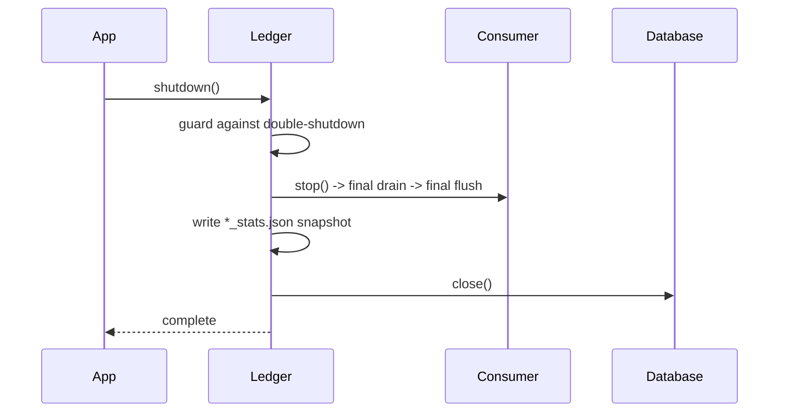

# 05 — Runtime Flows

Traces through the six operations that matter most. Each is annotated with the
exact source anchors so you can follow along.

## 5.1 `evaluate()` — the hot path

Called on the model-serving path, `DecisionLedger.evaluate(ctx, confidence)`
does the following work (`__init__.py:225-258`):



**Relevant branches** (`gatekeeper.py:193-245`):
* Unknown context, inactive context, `n_samples < min_sample_size`, or missing
  `q_hat` → `ESCALATE`.
* Exploration is **call-count deterministic** not random: `n % N == 0`.

**Non-conformity:** `s = 1 - confidence` (`gatekeeper.py:225`). Delegate when
`s <= q_hat`.

**Performance contract:** must be microseconds; telemetry push is optional and
off-path. Benchmark: p50 7.7 µs / p99 26.6 µs with telemetry; ~1.05 µs
without.

## 5.2 Telemetry capture → durable decisions

```mermaid
sequenceDiagram
    participant RB as RingBuffer
    participant C as BatchConsumer thread
    participant DB as Database

    Note over RB,C: producer(s) push; consumer polls
    loop every 100ms or 1000 records
        C->>RB: pop_batch(1000)
        C->>C: append to in-memory batch
        alt batch_size reached or flush_interval elapsed
            C->>DB: batch_insert(records) in one transaction
            note over DB: BEGIN..COMMIT, rollback on error, 3 tries
            alt insert fails 3x
                C->>C: hold in memory, 100k cap, critical logs
            end
        end
    end
```

Flow details & the ring-buffer tiering:
* RingBuffer pushes are lock-free deques with size tiers: beyond soft limits it
  drops **exploratory records first**: no producer is ever blocked.
  `[E]` (`telemetry.py` ring buffer docstring + drop logic).
* `drain_now(n=10000)` is the synchronous drain used by `calibrate()` to make
  pending decisions durable before calibration.

## 5.3 `log_outcome()` — ground truth



* Validation is centralized in `OutcomeCollector` (`outcomes.py`).
* A **single** outcome per decision is enforced by the `UNIQUE` column.

## 5.4 `calibrate()` — the learning loop

`DecisionLedger.calibrate()` (`__init__.py:293-330`) orchestrates:



Drift signal: when the current `q_hat` differs materially from the active
policy's `q_hat` (or sample feature distributions shift), the pipeline keeps
the old threshold but flags drift (see `detect_drift` + `dql` in
`pipeline.py`/`calibration.py`).

## 5.5 Policy reload (hot swap)

`reload_policy` builds a fresh mapping `{context_hash -> CalibrationContext}`
and swaps the whole dict under the single `RLock`; concurrent `evaluate()` sees
either the old or new snapshot, never a mix (`gatekeeper.py` reload docstring).
Artifact pipeline (`policy.py`): `PolicyGenerator.generate` → validate via
`validate_policy` (schema/type/value checks) → write `policy_<ts>.yaml` →
symlink/copy `policy_latest.yaml`.

## 5.6 Shutdown



Fail-closed behavior: any `evaluate()` after shutdown raises
(`__init__.py` closed-state assert), deliberately signaling misuse rather than
silently delegating.

## 5.7 End-to-end week-1 scenario (mirrors `src/tests/test_integration_week1.py`)

1. Synthetic model produces decisions across 100 contexts.
2. Half get outcomes (`log_outcome`), half stay pending.
3. `calibrate()` drains → joins → computes thresholds → writes policy
   artifacts → reloads.
4. Assertions: gatekeeper delegates known-good contexts, escalates unknown /
   insufficient-sample contexts, exploration rate ≈ configured, policy files
   exist and validate.

## 5.8 Concurrency outline

| Concern | Mechanism |
| --- | --- |
| Hot path | single `RLock` around evaluate/explore/reload; snapshot immutability |
| Telemetry | lock-free deque (single producer append) |
| Persistence | one writer (consumer thread), thread-local connections elsewhere |
| Reads during reload | swap-on-write snapshot ⇒ readers never see partial |
| Stress contract | `test_storage_pipeline` + `test_integration_week1` verify no crash/data-loss under producer+consumer concurrency |