# 12 — Complete Architecture Diagrams (Mermaid)

Ten diagrams derived from the actual repository (HEAD `b06cd6f`, `1.0.0rc1`).
Every node is traceable to a module/constant you can open. Where the repository
provides no evidence for a component (frontend, cloud, TLS, authentication,
hosted CI …), it is either **omitted** or explicitly marked **UNKNOWN** — never
invented.

Diagram conventions:

* `ESCALATE` / `DELEGATE` / `EXPLORE_SHADOW` are the three gate actions
  (`gatekeeper.py`).
* Constants cited verbatim: `POLL_INTERVAL_S = 0.1`, `FAILURE_BACKOFF_S = 1.0`,
  `BACKLOG_CAPACITY = 100_000`, `BACKLOG_ALERT_LEVEL = 50_000`
  (`consumer.py:40-47`); ring-buffer tiers at `telemetry.py:91-101`; schema DDL
  at `database.py:94-158`.

---

## 1. System Context Diagram

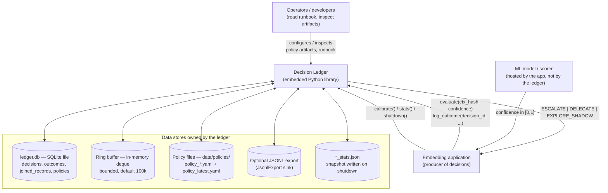

**External systems:** None detected at runtime. The package imports no
HTTP/network library; there is no server, no API gateway, no message broker,
no cloud dependency to draw. `decision ledger iv.pdf` is a spec document, not a
runtime system.

### How to read this diagram

The box in the middle is the whole `decision_ledger` package. Anything outside
it is *not* part of the system: the app is a host, the model is a foreign
scorer, and operators touch the ledger only through YAML files and the runbook.
The five rounded boxes on the right are the only things the ledger persists.

### Important observations

1. **No runtime external systems** — the ledger is self-contained (stdlib
   `sqlite3` + 2–3 PyPI libs). Its "network" is the filesystem.
2. **The app is the only caller** — there is no user-facing frontend; humans
   are *operators*, not users (`docs/RUNBOOK.md`).
3. **State is split across five stores** — an in-memory volatile buffer
   (ring), a durable SQLite file, versioned YAML artifacts, an optional JSONL
   export, and shutdown stats. This split (fast vs durable vs auditable) is the
   backbone of the design `[E]`.

### Questions I should ask myself

1. What happens to decisions that are still in the ring buffer when the process
   is hard-killed?
2. Why does the ledger keep *both* a SQLite database and YAML policy files?
3. Where does `policy_latest.yaml` point, and who reads it?
4. What would need to change if the model were an external HTTP service?
5. Is `_stats.json` part of the ledger's durable state or pure observability?
6. Which external system is missing from this diagram that a *real* deployment
   would obviously need? (Answer in `10`.)

---

## 2. Container Diagram

There is no frontend, web server, queue, or cache to draw — those are the
**UNKNOWN/absent** categories. The real "containers" are: the installed
package, the host process with its threads, the CLI executable, and the
persistence artifacts.

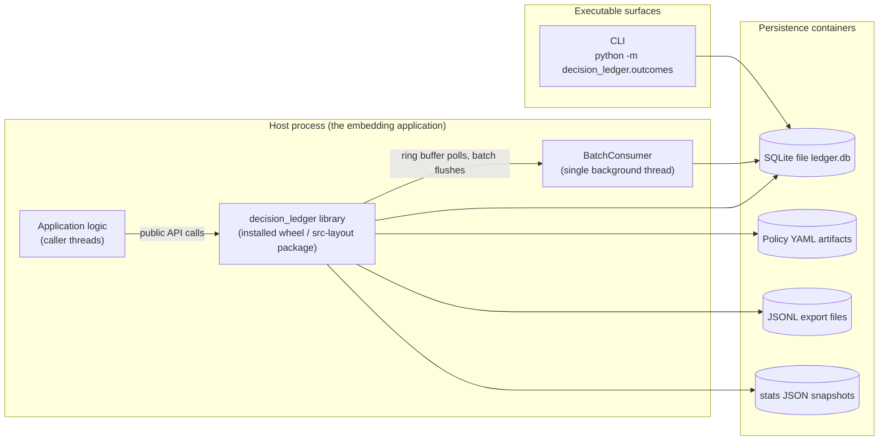

**Explicitly absent / UNKNOWN:** frontend (none), HTTP server (none), message
broker (none — the ring buffer is in-process), external cache (none — the
policy snapshot is an in-process dict), cloud services (none).

### How to read this diagram

Everything lives inside one process except the four persistence artifacts and
the CLI (which runs standalone). The library never starts its own server; the
app starts the library, and the library starts exactly one extra thread
(`BatchConsumer`, `consumer.py:134`).

### Important observations

2. The **CLI is a second deployment unit** targeting only the SQLite file — it
   logs outcomes without starting a consumer (`outcomes.py:531-603`).
3. **Two process shapes, one library**: embedded (threads + buffer + consumer)
   vs. one-shot (CLI opens DB, writes, closes).
4. The JSONL/`_stats.json` sinks show the persistence layer is *pluggable* —
   `JsonlExport` is a separate strategy from `BatchConsumer`
   (`consumer.py:396`).
5. **No configuration of a second process or replica is evidenced** — multi
   replica usage would be UNKNOWN.

### Questions I should ask myself

1. What happens if two processes open the same `ledger.db` and both adopt the
   "single writer" assumption?
2. Why does the CLI not start a ring buffer or consumer before logging an
   outcome?
3. Which of these containers would you run on a *different machine* if you
   needed scale, and what would that require?
4. Is `ledger.db` inside the repo (data/) or outside? Check `.gitignore`.

---

## 3. Component Diagram

Each major subsystem with its internal components and the wires between them.

```mermaid
flowchart TB
    subgraph Facade["DecisionLedger facade — __init__.py"]
        E["evaluate()"]
        L["log_outcome()"]
        C["calibrate()"]
        ST["stats()"]
        SD["shutdown()"]
        CLOSE["_require_open() — fail-closed guard"]
    end

    subgraph Serving["Serving subsystem — gatekeeper.py"]
        SNAP["policy snapshot Dict[bytes, CalibrationContext]<br/>(immutable swap under RLock)"]
        EV["Gatekeeper.evaluate()<br/>ESCALATE / DELEGATE / EXPLORE_SHADOW"]
        EXP["_should_explore()<br/>call-count deterministic (n % N == 0)"]
        RELOAD["reload_policy() / reload_policy_from_file()<br/>(+ lazy import of policy at :323)"]
        MET["get_metrics()"]
    end

    subgraph Capture["Telemetry subsystem — telemetry.py"]
        RB["RingBuffer (deque, bounded)<br/>push() / pop_batch() / tiered warnings / exploratory-first drop"]
        REC["DecisionRecord (frozen dataclass)"]
    end

    subgraph Drain["Durability subsystem — consumer.py"]
        LOOP["run() loop — poll 1000 / 0.1s"]
        DRAIN["drain_now() (≤10_000)"]
        FLUSH["_flush_to_db() — retry x3, backlog cap 100k"]
        JSONS["JsonlExport (strategy)"]
    end

    subgraph Store["Persistence subsystem — database.py"]
        CONN["thread-local connections"]
        SCHEMA["init_schema() / verify_schema()"]
        TX["batch_insert() — one BEGIN/COMMIT"]
        RETRY["_run_with_lock_retry() — 3 attempts"]
        JOIN["Joiner.materialize_join()<br/>LEFT JOIN + ON CONFLICT DO NOTHING"]
    end

    subgraph Truth["Ground truth — outcomes.py"]
        OC["OutcomeCollector.log_outcome()<br/>validation: exist / value[0,1] / source / JSON"]
    end

    subgraph Learn["Calibration subsystem — calibration.py"]
        THRESH["compute_threshold()<br/>empirical-risk prefix + Wilson bound"]
        CUR["calibrate_context() / calibrate_by_context()"]
        DRIFT["detect_drift()"]
        MIN["min_sample_size enforcement"]
    end

    subgraph PolicyS["Policy subsystem — policy.py"]
        GEN["PolicyGenerator.generate_policy()"]
        VAL["validate_policy()"]
        LATEST["_refresh_latest_link() -> policy_latest.yaml"]
        ROLL["rollback_policy() / load_latest_policy()"]
    end

    subgraph Orchestrate["Orchestration — pipeline.py"]
        PIPE["CalibrationPipeline.run_calibration()"]
    end

    E --> CLOSE
    E --> EV
    EV --> SNAP
    EV --> EXP
    EV --> REC
    REC --> RB
    LOOP --> RB
    LOOP --> FLUSH
    DRAIN --> RB
    DRAIN --> FLUSH
    FLUSH --> TX
    TX --> CONN
    SCHEMA --> CONN
    RETRY --> CONN
    JOIN --> CONN
    L --> OC
    OC --> CONN
    C --> DRAIN
    C --> JOIN
    C --> PIPE
    PIPE --> THRESH
    PIPE --> CUR
    PIPE --> DRIFT
    PIPE --> MIN
    PIPE --> GEN
    GEN --> VAL
    VAL --> LATEST
    VAL --> ROLL
    PIPE --> RELOAD
    ST --> CONN
    ST --> RB
    SD --> LOOP
```

### How to read this diagram

Read it as seven columns: the facade is the only entry point; `evaluate()` goes
down the left (serving → telemetry → drain → persist); `calibrate()` goes down
the right (drain → join → learn → policy → reload). The database column is the
shared spine: every subsystem that persists hangs off `database.py`'s
thread-local connections.

### Important observations

1. **`evaluate()` has two exits**: the synchronous action return, and the
   off-path push into the ring buffer — this is the hot-path decoupling.
2. **`calibrate()` is a transaction-shaped sequence**: drain (make durable) →
   join (materialize) → learn (calibrate) → publish (artifact) → reload
   (hot swap). Any fail there means *no new policy*, and the gatekeeper keeps
   the old snapshot.
3. The **policy snapshot is copied whole, never mutated in place** — that is
   what makes concurrent readers safe (copy-on-write).
4. **`_should_explore` is deterministic** — no PRNG, so experiments are
   reproducible and rates exactly measurable.
5. `gatekeeper.py:323` performs a **lazy import of `policy`** to break the
   only import cycle — visible evidence of deliberate boundary management.

### Questions I should ask myself

1. Which components are *never* on the hot path, and why does that matter?
2. If `_flush_to_db` fails 3 times, where do the records live and what
   happens at the 100k cap?
3. Trace one field of `DecisionRecord` end-to-end (record → buffer → batch →
   `decisions` row). Which docs make this easy? (`consumer.py:340`)
4. Why does `calibrate()` call `drain_now()` *before* joining?
5. What exactly does `reload_policy` swap, and how do concurrent `evaluate()`
   calls see a consistent snapshot?

---

## 4. Dependency Diagram

Dependencies are the real `import` edges, verified from source.

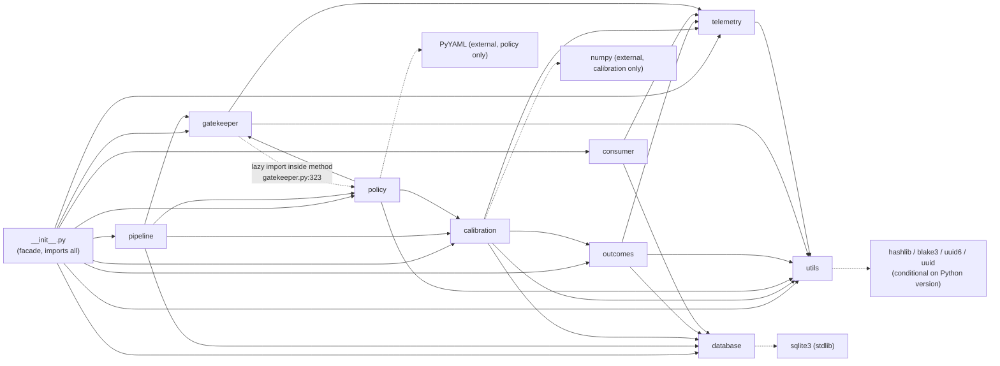

**Identity rule:** the layering is a *DAG plus one lazy edge*. `telemetry`
and `utils` are the leaves (no imports of the package besides each other).
`__init__.py` is the root (imports everything).

### How to read this diagram

An arrow `A → B` means "module A imports module B at load time" (dashed = lazy,
function-level only). The diagram is read top-down: the facade at top; leaves
(`utils`, `telemetry`, `database`) at the bottom, depending only on stdlib.

### Important observations

1. **The layering is clean** — the only cycle would be `gatekeeper` ⇄
   `policy`; it is resolved with a lazy import, not by cutting the conceptual
   dependency.
2. **`numpy` is deliberately isolated** to `calibration` — hot-path modules
   (`gatekeeper`, `telemetry`) never import it, keeping import-time cost off
   the serving path `[E]`.
3. **`utils` is the leaf** everything shares (hashing, ids, time, validation) —
   a change there ripples everywhere.
4. **`database` is pulled by *everything except telemetry*** — the durability
   spine. `telemetry` is the only higher module that never touches SQLite.
5. `outcomes` depends on `telemetry` for `DecisionRecord` (the "offer" it
   pairs with its "verdict").

### Questions I should ask yourself

1. Why can `pipeline` import `gatekeeper` but `gatekeeper` may not import
   `pipeline`? What breaks if you force it?
2. If you moved the ring buffer into `database`, which arrows would appear and
   what hot-path cost would that imply?
3. Which module would you read to find the definition of *context identity*?
4. Does `calibration` depend on `outcomes`? What type crosses that edge?
5. Which external library is the *only* one used off the calibration path?

---

## 5. Request Lifecycle

There is no HTTP API. A "request" is a **public method call** into the facade.
The lifecycle below is the shared request-processing pipeline — every entry
point passes the same closed-state guard first.

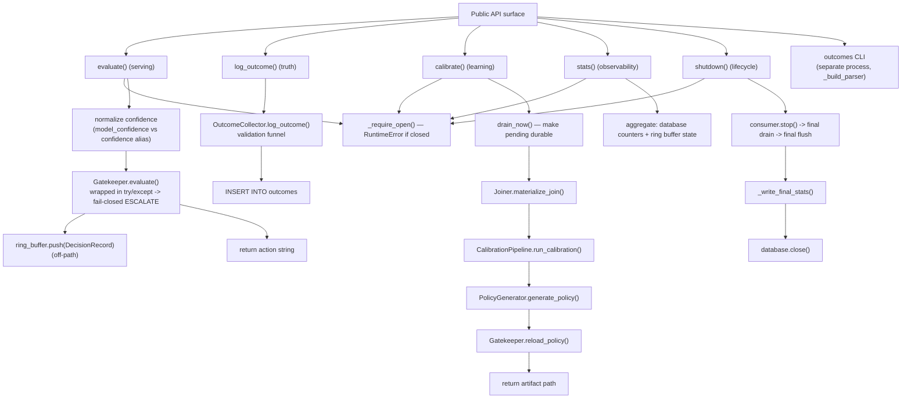

### How to read this diagram

Start at "Public API surface", pick an operation, and follow one branch to its
terminal. Note that `evaluate` is the *only* branch with a fail-closed
exception catch; the others fail loudly to the caller.

### Important observations

1. Every lifecycle branch begins with `_require_open()` — after `shutdown()`
   the whole API surface refuses work (fail-closed system-wide).
2. The **serving request is optimistic**: telemetry push is optional and on a
   different limb from the return value; a failure there must not fail the
   action.
3. `log_outcome` and `calibrate` are **asynchronous readers of the same
   store** — outcomes can arrive long after the decision was acted upon; only
   `calibrate()` reconciles them (via the joiner).
4. The CLI is an **out-of-band request** — it writes to the same SQLite file
   without touching the ring buffer.

### Questions I should ask myself

1. Which two branches mutate SQLite, and how do they avoid conflicting writes?
2. What does `drain_now` cap at, and why would `calibrate()` still be missing
   recent decisions? (`consumer.py:189`)
3. What happens to an `evaluate()` call when the gatekeeper raises? (Answer:
   `__init__.py:225-233`)
4. Where in this lifecycle could a decision exist with no outcome _forever_? 
5. Why must `stats()` and `shutdown()` also be guarded while `log_outcome`
   via CLI is not?

---

## 6. Data Flow Diagram

```mermaid
flowchart LR
    subgraph Prod["Producer (embedding app)"]
        P1["evaluate() calls"]
        M["model confidence"]
    end

    subgraph DL["Decision Ledger"]
        subgraph Stage1["Stage 1 — capture"]
            GK["Gatekeeper"]
            RB["RingBuffer"]
        end
        subgraph Stage2["Stage 2 — durable decisions"]
            CON["BatchConsumer"]
            D1[("decisions table")]
        end
        subgraph Stage3["Stage 3 — ground truth"]
            OC["OutcomeCollector / CLI"]
            O1[("outcomes table")]
        end
        subgraph Stage4["Stage 4 — reconciled pairs"]
            J["Joiner"]
            X[("joined_records table")]
        end
        subgraph Stage5["Stage 5 — learning"]
            CAL["ConformalCalibrator"]
            DR["drift detect"]
        end
        subgraph Stage6["Stage 6 — policy"]
            PG["PolicyGenerator"]
            YA[("policy_*.yaml + latest")]
            SNAP["gatekeeper snapshot"]
        end
        subgraph Stage7["Stage 7 — observability"]
            STAT["stats() / _write_final_stats"]
            ST[("*_stats.json")]
        end
    end

    P1 --> GK
    M --> GK
    GK -->|"ESCALATE/DELEGATE/EXPLORE_SHADOW"| P1
    GK -->|DecisionRecord| RB
    RB -->|"pop_batch 1000 / 0.1s"| CON
    CON -->|"batch_insert (BEGIN..COMMIT)"| D1
    OC -->|"INSERT"| O1
    D1 -->|"LEFT OUTER JOIN"| J
    O1 -->|"value"| J
    J --> X
    X -->|"independent, non-exploratory rows"| CAL
    CAL -->|"q_hat / risk / drift"| DR
    CAL --> PG
    DR --> PG
    PG --> YA
    YA -->|"validate + reload"| SNAP
    RB --> STAT
    D1 --> STAT
```

### How to read this diagram

Follow the **seven stages left-to-right**: capture → durable decisions →
ground truth → reconciled pairs → learning → policy → observability. Every
arrow is a real method/table. The loop closes when a fresh policy snapshot is
swapped into the gatekeeper at the top (`YA → SNAP → GK`).

### Important observations

1. The **stages are strictly ordered** — a decision cannot calibrate before
   it is both durable *and* paired. That ordering is why `calibrate()` drains
   first.
2. **Two source tables, one derived table** (`joined_records`) — the
   calibration stage never joins tables itself; it reads one flat store.
3. The ring buffer feeds both the consumer (decisions) and `stats()`
   (observability), but never the calibration stage.
4. `EXPLORE_SHADOW` outcomes still flow into `joined_records`, but the
   calibrator **filters** them (`is_independent and not is_exploratory`,
   `calibration.py:151`).
5. Drift can **stop** the pipeline from publishing — the old snapshot stays
   active.

### Questions I should ask myself

1. At which stage is a record considered "lost" if the process dies?
2. Why is `joined_records` a *table* and not a view — what does materialization
   buy, and what does it cost? (`database.py:687-701`)
3. How does an `EXPLORE_SHADOW` decision ever become a trusted delegate?
4. Which arrow is only correct because of `ON CONFLICT DO NOTHING`?
5. What stops the pipeline from publishing a threshold for a context with 3
   samples?

---

## 7. Authentication Flow (adapted — the ledger has **no authentication**)

The repository contains **no user authentication, no sessions, no tokens, no
log-in, no middleware**. The closest real analogies, adapted honestly:

* "Authentication" → **context identity derivation** (`utils.make_context_hash`);
  the ledger only trusts hashes that exist in the policy snapshot.
* "Token/session" → **`decision_id` (UUIDv7)** minted per evaluation, carried
  through the ledger as the id by which outcomes are later attached.
* "Middleware/authorization" → the **fail-closed gatechecks** in `Gatekeeper`
  and the facade.

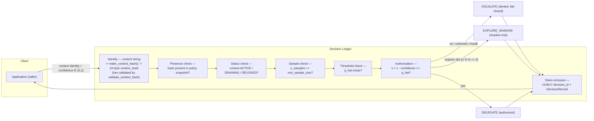

### How to read this diagram

Read it as "what must be true before the ledger lets the model act". Every box
is a check; the only "credential" is the context hash, and the only "session"
is the recorded decision. Anything you can't prove → `ESCALATE`.

### Important observations

1. **There is no human identity anywhere** — the "user" is an embedding
   application that holds no credentials; authorization is *statistical* (does
   the historical risk budget allow this) not *identity-based*.
2. The **fail-closed chain is ordered by cost**: presence → status → sample →
   threshold → gate. Each check is cheap and each denies without side effects.
3. **`EXPLORE_SHADOW` is a third authorization outcome** — neither denied nor
   fully delegated; it is a *measuring* branch that reports back through the
   same token pipeline.
4. Security here is really **trust-in-the-data**: anyone who can write
   `policy_latest.yaml` effectively rewrites the authorization policy — worth
   flagging in ops.
5. `confidence` is clamped into [0,1] (`utils.py:258-282`) before the gate —
   malformed upstream scorers degrade to the safest interpretation.

### Questions I should ask myself

1. What "authenticates" a semantic context such that `evaluate()` and
   `log_outcome()` agree on the same context? 
2. If the policy file is tampered with, at which check does that surface?
3. Why is the exploration decision *deterministic* instead of random?
4. What is the "session" that connects a decision to its later outcome?
5. What does the ledger do when a context hash is not in the snapshot at all?

---

## 8. Database ER Diagram

Derived directly from the DDL (`database.py:94-158`).

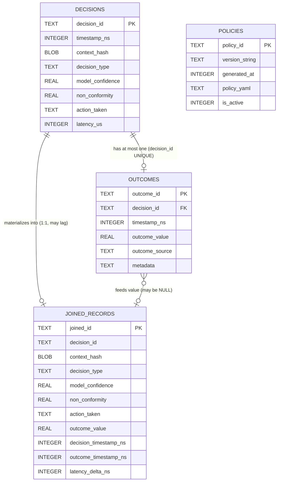

Indexes (all explicit in `_SCHEMA_SQL`): `decisions(timestamp_ns)`,
`decisions(context_hash)`, `decisions(context_hash, action_taken)`;
`outcomes(decision_id)`, `outcomes(outcome_source)`;
`joined_records(context_hash)`, `joined_records(decision_timestamp_ns)`;
`policies(is_active)`, `policies(generated_at)`.

### How to read this diagram

Four tables. `decisions` and `outcomes` are the **append-only source of
truth**; `joined_records` is a **derived, denormalized copy** (the decision row
plus nullable outcome fields) that the calibration stage consumes;
`policies` is a history/journal of generated policy YAML.

### Important observations

1. **Cardinality:** one decision can have **at most one** outcome (enforced by
   the UNIQUE decision_id in the collector + joiner). Hence the ERD shows `o|`
   not `o{`.
2. `joined_records` has **no FOREIGN KEY clause** — it is a materialized view;
   integrity is maintained by the joiner's watermark + `ON CONFLICT`, not by
   the database.
3. **`non_conformity` is denormalized** into both `decisions` and
   `joined_records` (computed as `1 - confidence` at write time) — trading a
   column for query simplicity.
4. **The null-trap:** `joined_records.outcome_value` can be `NULL` forever if
   an outcome arrives after the join ran (MED-1).
5. `policies` stores the *YAML text* (`policy_yaml`) plus an active flag — the
   table is a history ledger; the active rule comes from files at serving time.

### Questions I should ask myself

1. Which table is the single source of truth for "what the model did"?
2. Why store `non_conformity` and `action_taken` in *two* tables?
3. What does `latency_delta_ns` measure, and where is it computed?
4. What would a `DRAINING` state look like in this schema — is it a flag on a
   context? (It is in the YAML, not the DB!)
5. Which uniqueness constraint prevents a decision from having two outcomes?

---

## 9. Sequence Diagrams — the 5 most important business operations

### 9.1 Serving decision — `evaluate()`

```mermaid
sequenceDiagram
    participant App as Application
    participant L as DecisionLedger
    participant GK as Gatekeeper
    participant RB as RingBuffer

    App->>L: evaluate(ctx_hash, model_confidence=0.85, decision_type="route")
    L->>L: _require_open(); normalize confidence
    L->>GK: evaluate(ctx_hash, 0.85, "route")
    alt unknown / inactive / insufficient sample / no q_hat
        GK-->>L: ESCALATE (fail-closed branch)
    else explore slot (count-based)
        GK-->>L: EXPLORE_SHADOW
    else s = 1 - 0.85 <= q_hat
        GK-->>L: DELEGATE
    else
        GK-->>L: ESCALATE
    end
    L->>RB: push(DecisionRecord) [off-path, optional]
    L-->>App: return action string
    Note over App,L: hot path ~1µs w/o telemetry (benchmarked)
```

### 9.2 Recording ground truth — `log_outcome()`

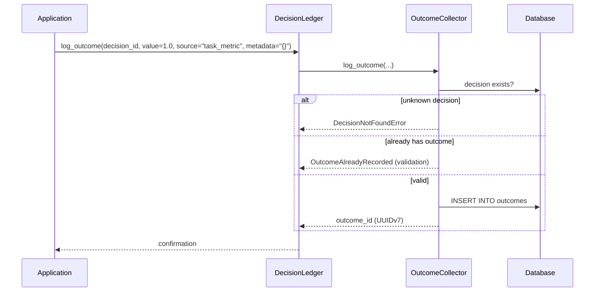

### 9.3 The learning loop — `calibrate()`

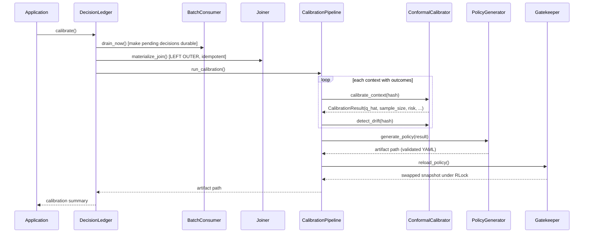

### 9.4 Durable flush — ring buffer → SQLite

```mermaid
sequenceDiagram
    participant RB as RingBuffer
    participant CON as BatchConsumer (thread)
    participant DB as Database

    loop every 0.1s (POLL_INTERVAL_S)
        CON->>RB: pop_batch(1000)
        CON->>CON: _append_to_batch(records)
        alt batch >= batch_size OR flush_interval elapsed
            CON->>DB: batch_insert(rows)
            Note over DB: BEGIN..COMMIT; rollback on error
            alt failure
                CON->>CON: retry up to 3; then hold with 100k cap<br/>+ CRITICAL logs, FAILURE_BACKOFF_S
            end
        end
    end
```

### 9.5 Shutdown — graceful durability

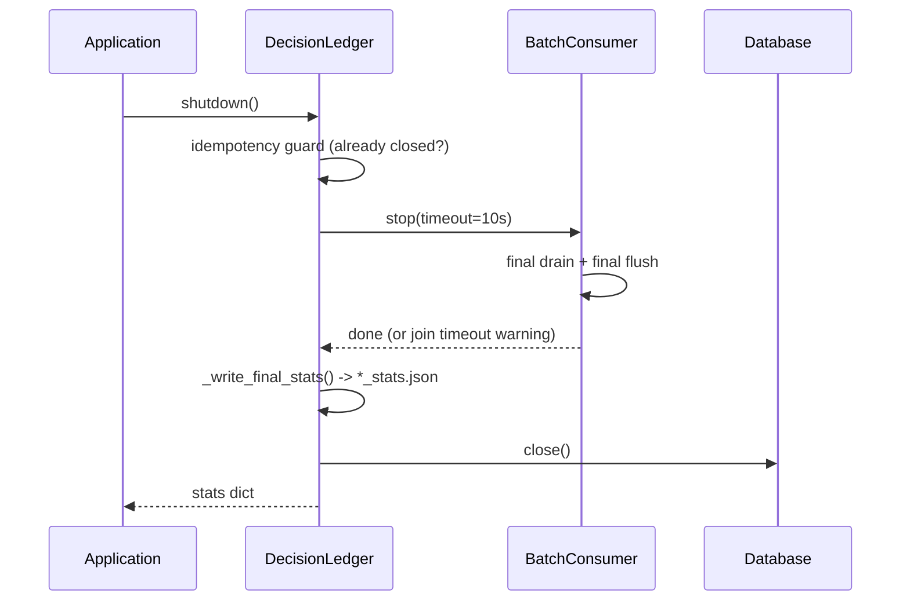

### How to read these diagrams

Each is a real call trace with the source line for every arrow (see §5 flow
doc for anchors). `alt/else` blocks are the *only* branches the code has; there
are no hidden happy paths.

### Important observations

1. **All five are single-process**: no network actor appears — even the
   "durable flush" is one thread talking to SQLite.
2. **Calibration is the only place outcomes influence behavior** — that is
   where `evaluate` and `log_outcome` "meet".
3. Shutdown is **two-staged** (stop → stats → close) to guarantee the final
   batch is flushed before the DB closes.
4. Error branches **fail closed or fail loudly** — `evaluate` fails closed,
   everything else raises to the caller.

### Questions I should ask myself

1. In 9.1, what happens if `RingBuffer.push` raises? (It can't — it's built
   not to raise.)
2. In 9.3, why must `drain_now` precede the join?
3. In 9.4, how many records can be lost on a hard kill at worst?
4. In 9.2, what two validation errors can `log_outcome` throw, and when?
5. Which diagram would you draw to prove "transactions are batched, not
   per-record"?

---

## 10. Deployment Architecture

There is **no cloud, no server fleet, no containers images, no TLS, no
load balancer, no hosted CI** in the repository (no `.github`, no K8s/Docker
manifests found). The deployment architecture that *is* evidenced:

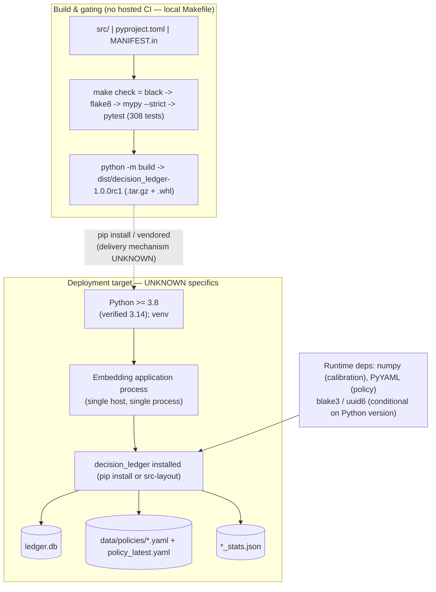

**UNKNOWN (explicitly):** delivery mechanism (pip/PyPI/internal), hosting
(Multi-process replicas? systemd? container orchestrator?), replication/sync
of `ledger.db`, monitoring stack, hosted CI, network topology.

### How to read this diagram

Top half is the *build-time* world: one developer machine produces an sdist
and a wheel after four check gates. Bottom half is the *runtime* world: one
process, one SQLite file, one policy directory. The dotted line between them
is the one part of the story the repo cannot show (how the artifact gets to the
target).

### Important observations

1. **The entire deployment is two files plus a process** — `ledger.db` and the
   `data/policies/` directory. That is the whole state a backup must capture.
2. **WAL is off precisely to keep `ledger.db` a single portable file**
   (`database.py:20-22`) — a deployment decision embedded in a runtime file,
   not in ops.
3. **No CI manifest exists** — the release gate lives in the Makefile and a
   verification-checklist commit; porting to real CI is left open.
4. **Dependencies vary by Python version** (stdlib `uuid.uuid7` / `hashlib.
   blake3` on 3.14+; the PyPI fallbacks `uuid6`/`blake3` below) — so the
   deployment environment strongly influences the dependency set.
5. **Example apps ship with the distribution** (`src/examples/`) as the
   documented integration templates.

### Questions I should ask myself

1. What exactly must be backed up, and what happens if only `policy_latest.yaml`
   is lost?
2. Where would WAL mode break this deployment, and why is that acceptable?
3. If you ran the ledger in two processes sharing one SQLite file, which
   singularity assumption breaks? (single-writer consumer thread)
4. What is the delivery contract that NOTHING in the repo specifies — and is
   that a gap?
5. How do you upgrade a policy in a *running system* — is any mechanism
   evidenced? (Hint: `reload_policy_from_file` + an operator triggering it.)

---

## Appendix — evidence map

| Diagram claim | Anchor |
| --- | --- |
| 3 gate actions | `gatekeeper.py:193-245` |
| Fail-closed catch-all | `__init__.py:225-233` |
| Deterministic exploration | `gatekeeper.py:231-245` |
| Ring buffer semantics/tiers | `telemetry.py:91-101`, `115-204` |
| Consumer loop/constants | `consumer.py:40-47,201-234` |
| Backlog cap/alert | `consumer.py:43-44,247-269` |
| `drain_now` ≤ 10k | `consumer.py:177-195` |
| Schema DDL | `database.py:94-158` |
| Join semantics | `database.py:687-701` |
| Validation funnel | `outcomes.py:350-395,478-486` |
| Calibration filter | `calibration.py:146-151` |
| Policy file structure | `data/policies/policy_*.yaml` (schema-1.0) |
| Facade wiring | `__init__.py:104-157` |
| CLI surface | `outcomes.py:531-603` |
| No HTTP/web imports | verified: zero matches across package |
| No `.github` CI | `Test-Path .github` → false |